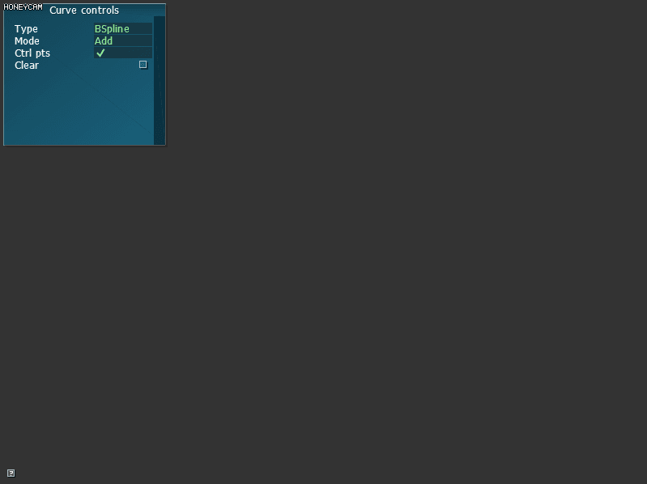

# IKviewer
This project is an assignment of CIS-562 Computer Animation. The project is about different types of curves/splines(Cubic Catmull-Rom Spline), including bezier, hermite and bspline.
## Bezier
De Casteljau's algorithm is used.

## Hermite
Given the condition that value, first derivative and second derivative must be equal, a matrix can be constructed and used to compute the control points.

## Bspline
De Boor's algorithm is used.

